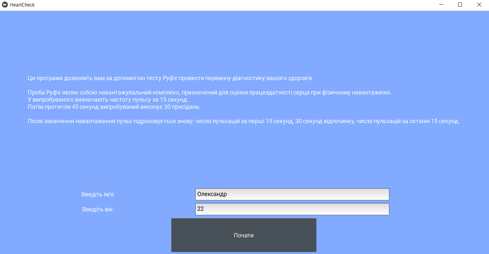
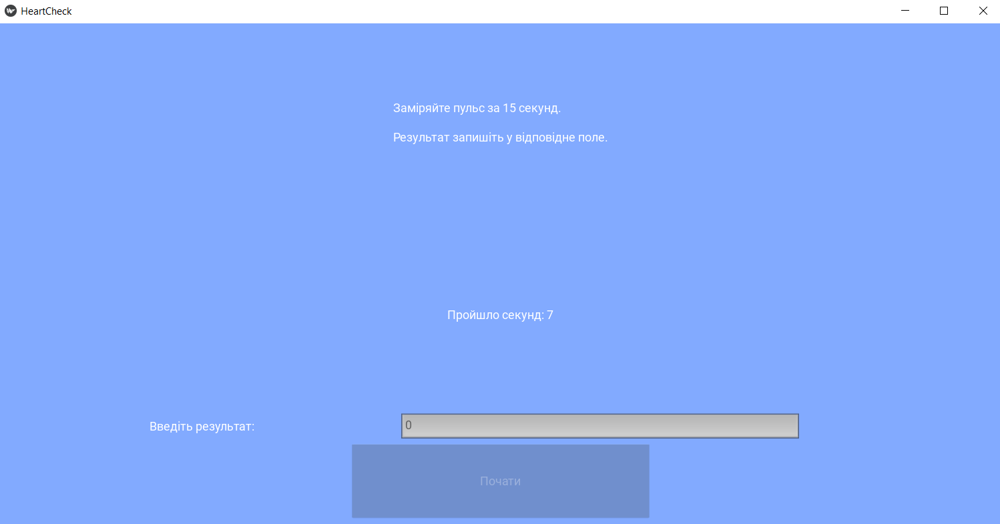
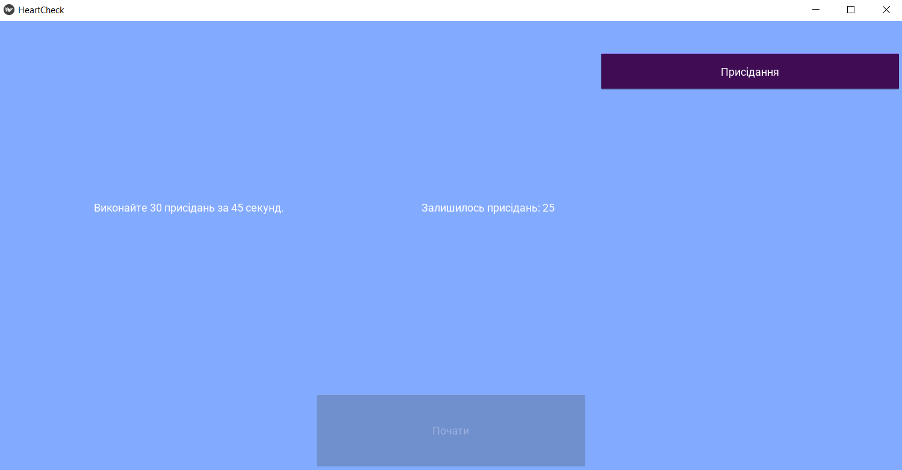

# HeartCheck - Ruffier Test Application

HeartCheck is a Kivy-based desktop application designed to perform the Ruffier test, a simple diagnostic tool to assess heart performance under physical load. The application guides users through a series of steps to measure their pulse and perform squats, then calculates the Ruffier index to evaluate heart fitness.

## Features
- Step-by-step interface for conducting the Ruffier test.
- Input fields for user name, age, and pulse measurements.
- Automated timer for pulse counting and squat exercises.
- Visual feedback with a "runner" widget to track squat progress.
- Calculation of the Ruffier index based on pulse measurements and age.
- Display of heart performance results with interpretive text.

## Project Structure
```
HeartCheck/
├── main_app.py            # Main application logic and UI setup
├── sits.py           # Sits widget for tracking squat count
├── seconds.py        # Seconds widget for countdown timer
├── runner.py         # Runner widget for squat animation
├── instructions.py   # Text instructions for the Ruffier test
├── ruffier.py        # Logic for calculating the Ruffier index
├── README.md         # Project documentation
```

## Requirements
- Python 3.8+
- Dependencies (listed in `requirements.txt`):
  - `kivy==2.3.0`

## Installation
1. **Clone the repository**:
   ```bash
   git clone https://github.com/your_username/heartcheck.git
   cd heartcheck
   ```

2. **Create a virtual environment**:
   ```bash
   python -m venv venv
   source venv/bin/activate  # On Windows: venv\Scripts\activate
   ```

3. **Install dependencies**:
   ```bash
   pip install -r requirements.txt
   ```

4. **Run the application**:
   ```bash
   python main_app.py
   ```

## Usage
1. **Start the application**:
   - Run `python main.py` to launch the application.
   - The first screen prompts for the user's name and age (minimum age: 7).

2. **Follow the Ruffier test steps**:
   - **Step 1**: Measure your pulse for 15 seconds and enter the result.
   - **Step 2**: Perform 30 squats in 45 seconds, guided by a visual "runner" widget.
   - **Step 3**: Measure your pulse twice more (first 15 seconds and last 15 seconds of a minute) after resting.
   - **Result**: The application calculates the Ruffier index and displays the heart performance level (low, satisfactory, average, above average, or high).

3. **Navigation**:
   - Use the "Start" or "Continue" buttons to progress through the screens.
   - Input validation ensures valid numbers for age and pulse measurements.

## Ruffier Test Logic
- The Ruffier index is calculated as: `IR = (4 * (P1 + P2 + P3) - 200) / 10`, where `P1`, `P2`, and `P3` are pulse measurements.
- The index is evaluated against age-specific thresholds to determine heart performance.
- Results are categorized into five levels: low, satisfactory, average, above average, and high.

## Files Description
- `main_app.py`: Defines the Kivy app, screen manager, and UI screens for instructions, pulse measurements, squats, and results.
- `sits.py`: Implements a widget to display the remaining number of squats.
- `seconds.py`: Implements a countdown timer widget for pulse and squat timing.
- `runner.py`: Implements an animated button to guide squat pacing.
- `instructions.py`: Contains text for test instructions and prompts.
- `ruffier.py`: Calculates the Ruffier index and interprets results based on age.

## Notes
- The application is designed for users aged 7 and older. For younger users, it defaults to age 7 and displays a warning.
- The UI uses Kivy's `ScreenManager` for navigation and `BoxLayout` for organizing widgets.
- The background color and button styles are customized for a user-friendly experience.

## Screenshots
### Start Sreen


### Pulse Sreen


### Sits Sreen

